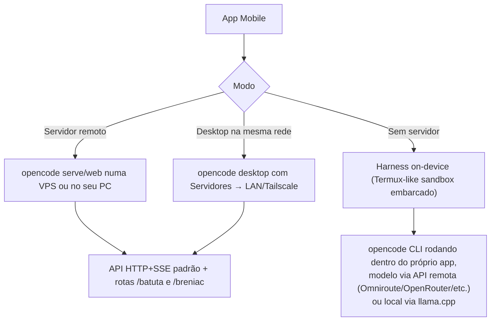

# PRD — App Mobile próprio do fork (OpenCode + Batuta + Breniac)

**Status:** Rascunho / descoberta
**Branch de referência:** a criar a partir de `dev` (ex.: `mobile`)
**Autor:** Ronaldo + Claude (sessão de pesquisa)
**Última atualização:** 2026-08-23
**Documentos relacionados:** [`docs/prd/breniac-voice-assistant.md`](./breniac-voice-assistant.md) (branch `breniac`), [`docs/vps-hosting.md`](../vps-hosting.md), [`docs/prd/mobile-api-reference.md`](./mobile-api-reference.md) (contrato técnico de API — toda rota que o app vai consumir, autenticação, e o desenho do pareamento por QR code)

---

## 1. Por que este documento existe

Foi pedido pra investigar se os apps mobile já existentes pro OpenCode cobrem as funcionalidades deste fork (Batuta, Breniac) e, com base nisso, decidir se vale criar um app mobile próprio — não como cliente fino da API padrão, mas como produto com funcionalidades novas: assistente de voz em tempo real acessível (incluindo para pessoas com tetraplegia), desenvolvimento de jogos 3D com sandbox de teste no próprio app, e a possibilidade de rodar o agente **no próprio celular**, sem depender de nenhum computador.

## 2. O que já existe no mercado (pesquisa)

| App | Tipo | Cobre Batuta? | Cobre Breniac (voz)? | Roda sem servidor remoto? |
| --- | --- | --- | --- | --- |
| [OpenCode: AI Coding Agent](https://play.google.com/store/apps/details?id=cc.agentlabs.opencode) (Agent Labs) | Cliente fino (React Native) | Não | Não | Não — precisa de servidor opencode rodando em outro lugar |
| [OpenCode Mobile](https://github.com/dzianisv/opencode-mobile) (dzianisv, open source, F-Droid) | Cliente fino (React Native/Expo) | Não | Não | Não |
| MobileCode | Cliente fino genérico | Não | Não | Não |
| [droid-harness](https://github.com/eibragaa/droid-harness) | Harness on-device (Termux) | N/A (não é opencode) | N/A | **Sim** — roda Claude Code/Codex/OpenCode/Aider + llama.cpp local no celular |
| codex-termux, Hermes Agent (Termux) | Harness on-device via Termux | N/A | N/A | **Sim** |

**Conclusão da pesquisa (resumo do que já foi levantado nesta sessão):** todo cliente mobile existente pro OpenCode fala só a **API HTTP+SSE padrão** (`/session`, `/message`, `/event`) — a mesma API do projeto original. Batuta e Breniac usam rotas **próprias deste fork**:

- Batuta: `packages/opencode/src/server/routes/instance/httpapi/{handlers,groups}/batuta.ts`
- Breniac: `packages/opencode/src/server/routes/instance/httpapi/{handlers,groups}/breniac.ts` (branch `breniac`)

Nenhum app de terceiros sabe que essas rotas existem — mesmo que um usuário aponte o OpenCode Mobile pro nosso servidor, ele não vai enxergar Batuta nem conseguir usar Breniac. **Isso confirma o gap**: hoje, a única forma de usar as funcionalidades exclusivas deste fork em um celular é abrir a UI web (`opencode web`) no navegador do celular — funcional, mas não é um app, não tem ícone, não tem notificação push, e (mais importante pro caso de acessibilidade) não tem microfone/voz em tempo real desenhado pra mobile.

Já existe também um projeto ("droid-harness" e similares) provando que **rodar um harness de coding agent inteiro dentro do próprio Android via Termux é viável hoje** — zero dependência de nuvem, usando `llama.cpp` pra modelos locais. Isso é relevante direto pro pedido de "gente que não tem computador mas tem celular".

## 3. Visão do produto

Não propomos reconstruir os clientes finos que já existem — isso seria retrabalho. A proposta é um app que faz o que nenhum concorrente faz:

1. **Breniac mobile-first.** O PRD do Breniac diz explicitamente, na seção de não-objetivos: *"Não é objetivo cobrir mobile/web público — o foco é o app desktop (Electron)."* Esse app é onde essa lacuna se fecha. No celular, voz não é um recurso a mais — é potencialmente a **interface primária**. Alguém com tetraplegia consegue, hoje, falar com o celular (Android/iOS já têm acessibilidade de voz nativa robusta); o que falta é um Breniac que rode nesse contexto, entenda comandos de app ("abre meu projeto X", "cria uma atividade Batuta pra revisar esse PR") e de sessão, e responda falando — sem exigir nenhuma interação manual em nenhum momento do fluxo, do login ao deploy.
2. **Batuta acessível de qualquer lugar, com visualização própria.** Não um clone da tela desktop — uma versão mobile-native da lista de atividades, delegação orquestrador→worker, e status em tempo real (a cena 3D pode virar um resumo textual/2D leve no celular; ver seção 6).
3. **Harness on-device opcional**, pra quem não tem computador. Ver seção 5.
4. **Sandbox de teste (incluindo jogos 3D) dentro do próprio app**, pra fechar o ciclo "pedi pro agente construir → vejo rodando" sem precisar de outro dispositivo. Ver seção 6.

### 3.1 Persona-âncora

A pessoa com tetraplegia que quer desenvolver software é a persona que define os requisitos mínimos de acessibilidade do produto (não é um "extra", é o critério de design): **tudo que existe no app precisa ser alcançável só por voz, do início ao fim** — abrir o app, autenticar, escolher/criar projeto, conduzir a sessão, revisar diffs (por resumo falado), aprovar tool calls, e — quando o item 4 acima existir — ouvir/ver o resultado rodando. Qualquer funcionalidade que exija um toque obrigatório na tela quebra esse critério e precisa ter uma alternativa por voz documentada antes de ser considerada "pronta".

## 4. Arquitetura: três modos, um só app

A pesquisa mostrou que existem dois mundos que hoje são tratados como mutuamente exclusivos (cliente remoto vs. harness local). Não precisam ser. Proposta: o app suporta os dois, com o usuário escolhendo (ou o app detectando automaticamente) qual usar por projeto:

- **Modo remoto** (prioridade 1 pra v1): reaproveita 100% o servidor que já existe — nenhuma mudança de backend necessária além do que Batuta/Breniac já expõem. É o [guia de VPS](../vps-hosting.md) que acabamos de escrever, só que com um app nativo em vez do navegador.
- **Modo desktop-na-rede**: idêntico ao remoto, tecnicamente — o "servidor" é o próprio OpenCode Desktop do usuário, alcançável via Wi-Fi local ou Tailscale (mesmo padrão que o OpenCode Mobile de terceiros já usa, comprovadamente funcional).
- **Modo on-device** (v2, pra quem não tem computador): usa uma sandbox Linux embarcada no app (mesma ideia do `droid-harness`/Termux) rodando o CLI opencode de verdade dentro do celular. O modelo de IA continua vindo de um provedor remoto (a menos que o usuário opte por um modelo local via llama.cpp, o que é pesado pra a maioria dos aparelhos) — o que roda local é o **harness**: shell, edição de arquivo, git, execução de comando. Isso é o que de fato resolve "não tenho computador": a pessoa não precisa de nenhuma outra máquina, o celular É o ambiente de dev.

## 5. Harness on-device — o que isso exige de verdade

Baseado no que já está provado por projetos como `droid-harness`/`codex-termux`/Hermes Agent:

- **Viabilidade confirmada**: rodar um harness de coding agent (shell + fs + git) dentro de um ambiente Linux userspace no Android (via proot/Termux ou uma sandbox equivalente embarcada no próprio app, sem exigir que o usuário instale o Termux separadamente) é algo que já roda em produção em pelo menos 3 projetos abertos, em hardware Snapdragon comum.
- **Risco conhecido a mitigar**: o "phantom process killer" do Android 12+ mata sessões longas em background — precisa de foreground service + notificação persistente (padrão Android pra apps que precisam continuar rodando, ex. apps de música/GPS) pra uma sessão de agente não morrer no meio de uma tarefa longa.
- **Modelo de IA**: continua vindo de um provedor via API (Omniroute, o mesmo já usado no resto do fork) — rodar um modelo local competente em hardware de celular ainda é limitado demais pra tarefas de coding real em 2026. `llama.cpp` local fica como opção experimental/offline, não como caminho principal.
- **Escopo do harness embarcado**: reaproveitar o próprio `packages/opencode` (é Bun/TypeScript — bun não roda nativo em Android ainda hoje sem trabalho extra; alternativa é empacotar via Node.js compilado pra Android, ou investigar um runtime alternativo). Este é o item de maior incerteza técnica do documento e precisa de uma spike técnica dedicada antes de qualquer estimativa de prazo.

## 6. Sandbox de teste (incl. jogos 3D) dentro do app

Da pesquisa sobre engines mobile em 2026: WebGPU já roda em praticamente todo navegador móvel relevante (Android Chrome, iOS Safari 26+), e motores como Godot e Babylon.js já têm exportação/target Web consolidada, incluindo fallback pra WebGL2 onde WebGPU não está disponível.

Isso abre um caminho direto e de baixo esforço relativo: o app não precisa embarcar um motor de jogo — ele precisa embarcar um **WebView com suporte a WebGPU/WebGL2** e um fluxo onde o agente, ao terminar de gerar/alterar um projeto de jogo (ex. exportado como build Web do Godot, ou um projeto Three.js/Babylon.js puro), publica esse build num endpoint servido pelo próprio backend do agente (local ou remoto) e o app abre isso na WebView in-app — o "sandbox" é literalmente rodar o jogo. Isso:

- Não exige rodar Unity/Unreal/Godot Editor no celular (inviável).
- Reaproveita a mesma infraestrutura de servir arquivos estáticos que o app já precisa ter pra outras coisas.
- Generaliza pra qualquer projeto Web (não só jogos) — o mesmo mecanismo serve pra "peça pro agente construir um site e veja rodando no celular".

## 6.1 Composer completo — paridade com os clientes de referência (Claude Code app, etc.)

O chat da Fase 1 (texto puro, enviar/receber) já funciona (ver `mobile-api-reference.md` §5.1), mas um cliente de coding agent de verdade — a régua aqui é o próprio app mobile do Claude Code — não para nisso. Antes de avançar pra Batuta (seção 3, item 2), o composer da sessão precisa fechar estas lacunas:

1. **Anexo de imagem (câmera + galeria).** Confirmado tecnicamente: `POST /session/:id/message` aceita uma parte `{type: "file", mime, url}` onde `url` é uma **data URL inline** (`data:image/jpeg;base64,...` — é assim que o próprio `packages/opencode/src/session/prompt.ts` já lê arquivo local e imagem colada, não existe endpoint de upload separado a construir). O app tira a foto ou escolhe da galeria (`expo-image-picker`), converte pra base64, e manda junto do texto na mesma chamada. Zero mudança de backend necessária.
2. **Troca de provedor/modelo por sessão.** `GET /provider` já lista provedores conectados e seus modelos; `GET /config/providers` lista o catálogo configurado. O composer precisa de um seletor (bottom sheet, como no app de referência) que manda `model: {providerID, modelID}` no `POST /session/:id/message` — o campo já existe no schema (`SessionPromptData.body.model`), só falta a UI.
3. **Modo de execução (Manual / Aceitar edições / Planejar / Automático).** Correção de uma versão anterior deste documento, que dizia que esse conceito não existia no backend — existe, só não é um "modo" único, é **dois mecanismos combinados** (mesmo jeito que o app desktop implementa, ver `packages/app/src/components/prompt-input-mode.tsx`):
   - **Agente**: `GET /agent` lista os agentes nativos, incluindo `build` (permissões normais) e `plan` (nega ferramentas de edição — é o que dá o modo "Planejar" de verdade). A seleção é **por mensagem**, não por sessão: o campo `agent` vai junto no `POST /session/:id/message` (já existe no schema, `SessionPromptData.body.agent`).
   - **Nível de auto-aceite de permissão**: isso sim é **só client-side** (não é um flag do servidor) — o desktop guarda localmente (`usePermission`, com escopo sessão ou diretório) se deve responder sozinho às permissões, e com qual nível (`false` = pergunta tudo, `"edits"` = auto-aceita só edição, `true` = auto-aceita tudo). O mobile replica isso: quando o nível não for `false`, o app responde `always` via `POST /permission/:id/reply` assim que o `permission.asked` chega, em vez de mostrar o card.

   Mapeamento pros 4 modos do app de referência: **Manual** = agente `build` + nível `false` (mostra tudo, comportamento atual da Fase 1). **Planejar** = agente `plan` + nível `false`. **Automático** = agente `build` + nível `true`. **Aceitar edições** = agente `build` + nível `"edits"` — esse último exige diferenciar "permissão de edição" das outras só pelo campo `permission`/`patterns` do pedido (ainda não mapeado neste app; os outros três modos não dependem disso e são o alvo da primeira implementação).
4. **Skills.** Já coberto pela API existente — `POST /session/:sessionID/command` (mobile-api-reference.md §5.1) roda comandos de skill; falta só uma UI pra listar/disparar (ex.: `/` no composer abre um picker, como o `/model` que já aparece nas respostas de texto hoje).
5. **MCP e memória.** MCP já documentado como fora de escopo da Fase 1 (§5.6 do `mobile-api-reference.md` — configuração avançada, não uso direto). Memória (`/memory`) já documentada em §6.2 do mesmo arquivo — o mobile só precisa espelhar a tela "Configurações → Memória" do desktop (toggle + modelo), sem lógica nova.
6. **Preparação para áudio (Breniac).** O Breniac ainda não foi mergeado (ver `mobile-api-reference.md` §6.3), mas o composer deve nascer com o ponto de extensão já pensado: o botão de anexo (câmera/galeria) e um futuro botão de microfone compartilham o mesmo padrão de "anexar mídia à mensagem antes de enviar" — a diferença é que áudio provavelmente vai por um caminho separado (WebSocket, conforme §7 abaixo), não pela mesma `data:` URL inline usada pra imagem. Não há trabalho de implementação a fazer agora além de não desenhar o composer de um jeito que precise ser refeito quando o botão de mic chegar (ex.: manter a barra de ações do composer extensível, um ícone por capacidade, não um botão só de "+" genérico escondendo tudo atrás de um menu).

## 6.2 Tema (claro/escuro, seguindo o sistema)

Nenhuma chamada de API envolvida — é puramente client-side, via `useColorScheme` do React Native (Expo já reexporta), que reflete o tema do SO em tempo real (inclusive troca automática ao vivo, sem reiniciar o app). Todo componente novo deve consumir cores de um token central (`src/lib/theme.ts`), nunca hex hardcoded inline como as telas da Fase 1 fizeram inicialmente — isso vira dívida técnica a limpar conforme as telas existentes forem tocadas.

## 7. Stack técnico recomendado

- **React Native + Expo**: é o que os dois clientes de terceiros já usam (validado em produção), tem suporte maduro a microfone/áudio, notificações push, foreground services (Android) e WebView com WebGPU. Reduz risco em relação a escolher algo não testado nesse domínio.
- **Reaproveitamento de lógica, não de UI**: a lógica de negócio de Batuta/Breniac que já existe em `packages/app` (TypeScript) não é diretamente reaproveitável em React Native (é SolidJS + DOM), mas os **contratos de API e tipos** (`packages/client`, `packages/protocol`, `packages/sdk`) sim — o app mobile deve consumir o SDK TypeScript já existente do projeto, não reimplementar chamadas HTTP na mão.
- **Streaming**: o app consome o mesmo canal SSE (`GET /event`) já documentado no PRD do Breniac. Para duplex de áudio de verdade (Breniac v2, barge-in), o precedente já existe no próprio código: o WebSocket usado hoje só para o terminal PTY (`handlers/pty.ts`) é o padrão de referência a estender.

## 8. Fases propostas

| Fase | Escopo | Depende de |
| --- | --- | --- |
| **1 — Cliente remoto completo** | App RN/Expo, conecta em servidor remoto (VPS ou desktop na rede), cobre sessões + Batuta + Breniac (texto e voz simples, reaproveitando a arquitetura já validada no PRD do Breniac) | Nada novo no backend — Batuta e Breniac já expõem API própria |
| **2 — Sandbox in-app** | WebView com WebGPU/WebGL2 servindo builds Web gerados pelo agente (jogos e outros projetos) | Fase 1 |
| **3 — Harness on-device** | Ambiente Linux embarcado rodando o CLI real, foreground service persistente, sem exigir servidor remoto | Spike técnica de viabilidade do runtime do `packages/opencode` em Android |
| **4 — Voz avançada (barge-in, duplex real)** | Migra Breniac mobile pra WebSocket de áudio (mesmo padrão do PTY) | Fase 1, e depende da v2 do Breniac desktop já estar madura |

## 9. Recomendação

**Vale a pena construir**, mas não como "mais um cliente de chat" — os concorrentes já resolveram bem esse pedaço. O que justifica o investimento é especificamente:

1. Ser a única forma de usar Batuta e Breniac em um celular (hoje, zero apps de terceiros cobrem isso, e a UI web no navegador não é acessível o suficiente pro caso de tetraplegia sem um app desenhado pra voz-primeiro).
2. O harness on-device (Fase 3) é o único item aqui que resolve de fato "não tenho computador" — sem ele, o app ainda depende de um servidor rodando em outro lugar (mesmo que seja uma VPS de $5/mês).
3. O sandbox in-app (Fase 2) fecha um ciclo que hoje não existe em nenhum client mobile: pedir, ver rodando, tudo no mesmo aparelho.

A Fase 1 sozinha já entrega valor real e usa só infraestrutura que já existe — é o ponto de partida natural, com risco técnico baixo. Fases 2–4 são onde o produto se diferencia de verdade, mas a Fase 3 em particular precisa de uma spike técnica antes de qualquer compromisso de prazo (rodar o `packages/opencode` — Bun/TypeScript — dentro de um ambiente Android é o maior risco técnico não resolvido deste documento).

## 10. Perguntas em aberto

- Nome/branding do app (reaproveita "OpenCode" ou usa o branding próprio do fork/Breniac?).
- iOS: o mesmo app-mobile-terceiro líder ainda não lançou iOS (só waitlist) — se formos rápidos na Fase 1, há uma janela de ser o único cliente iOS decente pra opencode, não só pra este fork.
- Modelo de custo: quem paga os tokens de voz/modelo quando o app é usado por alguém sem servidor próprio (Fase 3)? Precisa de uma decisão de produto antes da Fase 3, não é só técnica.
- Publicação na Play Store/App Store sob qual conta/organização — needs decision separada deste documento.

Sources (pesquisa desta sessão):
- [OpenCode: AI Coding Agent — Google Play](https://play.google.com/store/apps/details?id=cc.agentlabs.opencode)
- [dzianisv/opencode-mobile — GitHub](https://github.com/dzianisv/opencode-mobile)
- [eibragaa/droid-harness — GitHub](https://github.com/eibragaa/droid-harness)
- [Mobile Coding Terminal: The Complete Guide (2026) — Cosyra](https://cosyra.com/guides/mobile-coding-terminal.html)
- [CodeByVoice — voice-controlled Python assistant](https://www.ijraset.com/research-paper/codebyvoice-a-voice-controlled-python-programming-assistant)
- [XULIA — control system for people with tetraplegia](https://arxiv.org/pdf/2408.17314)
- [Best mobile game engines in 2026 — App Radar](https://appradar.com/blog/mobile-game-engines-development-platforms)
- [WebGL Game Development: Build Browser 3D Games (2026)](https://generalistprogrammer.com/tutorials/webgl-game-development-complete-browser-gaming-guide-2025)
